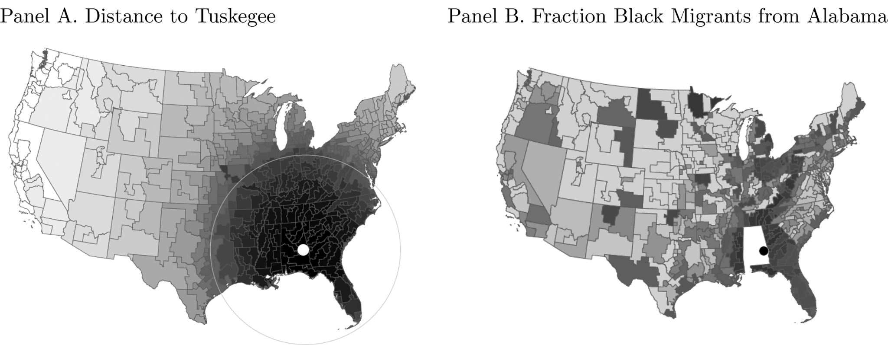
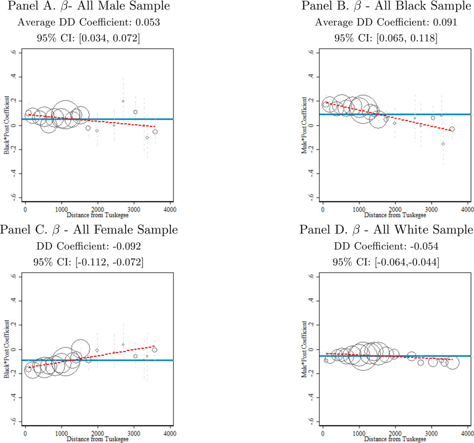
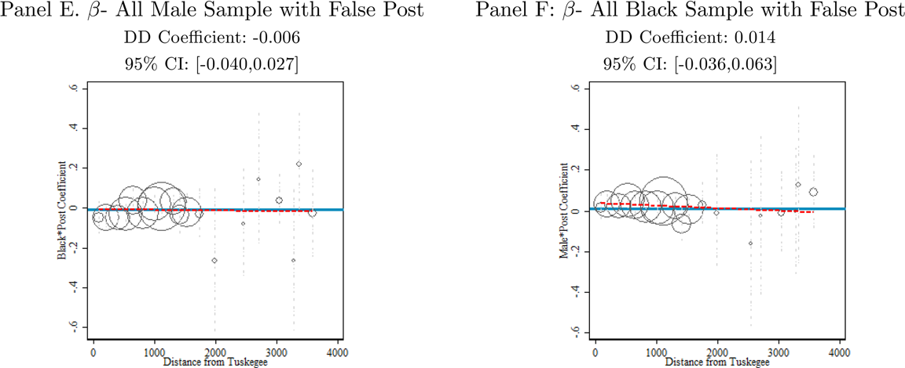
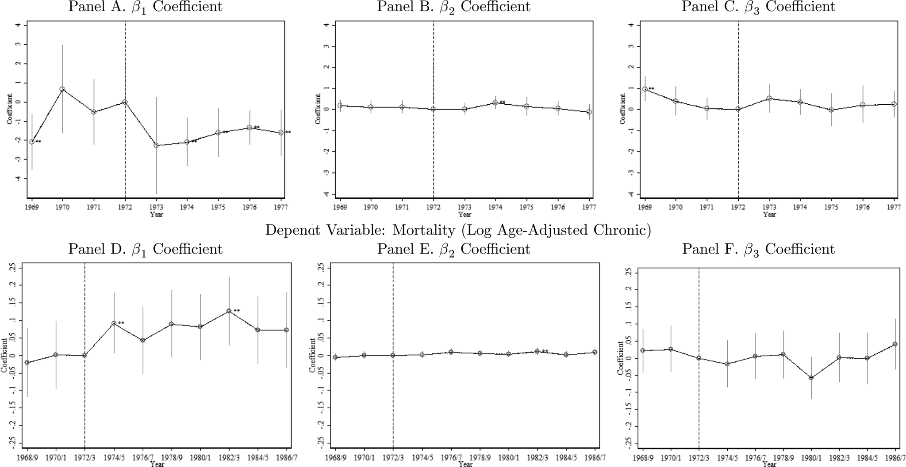

```{r setup, include=FALSE}
knitr::opts_chunk$set(echo = FALSE)
```

## Introduction 

- Tuskegee Study of Negro Male passively monitored hundreds of adult black men with syphilis despite availability of effective treatment
    - mistreatment or exploitation
- The intentions of the Tuskegee study was disclosed in 1972
- **Question** Can medical mistrust explain some racial disparity in health outcomes?
    - How did the disclosure affect utilization of health care among black populace?
    - What about health outcomes (mortality)?
- *The Tuskegee Study became a symbol of their mistreatment by the
medical establishment, a metaphor for deceit, conspiracy, malprac-
tice, and neglect, if not outright genocide.* -- Corbie-Smith et al. (1999)
    
## Tuskegee Study
- unethical and deadly experiment known as the Tuskegee Study of Untreated Syphilis in the Negro Male (TSUS)
- For 40 years (1932-1972), U.S. Public Health Service (PHS) followed hundreds of poor, black men in Tuskegee (Alabama)
    - majority with syphilis
    - to understand the natural course of the disease
    - denied effective treatment (penicillin), that had been quite the norm since mid-1940s

- *The germ that causes syphilis . . . and the complications that can
result from untreated syphilis were all known to medical science
in 1932—the year the Tuskegee Study began. Since the effects of
the disease are so serious, reporters in 1972 wondered why the
men agreed to cooperate. The press quickly established that the
subjects were mostly poor and illiterate, and the PHS had offered
them incentives to participate.* -- Jones (1992)    

- News of the experiment was disclosed to public in 1972 by Jean Heller of the Associated Press
- Journalists, social scientists, and medical researchers point to Tuskegee experiment as a reason that African Americans remain skeptical to the medical care

- *“In
retrospect the Tuskegee Study revealed more about the pathology
of racism than the pathology of syphilis; more about the nature of
scientific inquiry than the nature of the disease process. . . . The
degree of deception and the damages have been severely under-
estimated.”* -- Allan Brandt (1978)

## Trend in Disparity 
- See A&W (2017) page 421, Figure 1


## Data
- NHIS (health seeking behavior), health care utilization (1969--...)
    - NHIS is also linked to mortality files (later on) 
- County-level mortality statistics by age, race, and gender 
    - 1968 to 1988
    - aggregate to state economic area (SEA) to reduce random variation due to events


## Identification
- Use four different variations
    - timing (year of disclosure, 1972)
    - race
    - sex
    - proximity
    
- authors argue borrowing findings from the psychology literature that the vast amount of individuals tend to be affected by the news if they can relate to the news
    - concentrated among black men
    
- Black men living closer to Macon County, Alabama, (that contains Tuskegee) should be more affected.

## Proximity 
```{r echo=FALSE, image, out.width="75%", fig.cap="Figure 1. Proximity Measures"}

```

## Difference-in-Difference Findings
```{r echo=FALSE, image2, out.width="75%", fig.cap="Figure 2. Proximity Measures"}

```
```{r echo=FALSE, image3, out.width="75%", fig.cap="Figure 2. Proximity Measures"}

```
- These figures plot β coefficients from equation (1) estimated on various demo-
graphic group samples (all-male, all-black, all-white, and all-female) as indicated
by the figure headings and further subdivided into distance bins from Tuskegee.
The outcome variable for each regression is the log of age-adjusted chronic mortal-
ity. Panels A and B plot β coefficients on black*male*post in the all-male and all-
black sample, respectively. Panels C and D plot β coefficients on white*male*post
and black*female*post in the all-white and all-female sample, respectively. Panels
E and F plot the same coefficients as in Panels A and B, however, the time period
of the analysis is restricted to the pre-1974 period with all observations after 1969
constituting the post period. SEAs were grouped into K bins of 150 kilometers
of distance from Macon County each bin yielding a β k . Bins in the middle of the
country with less than 2,500 black men in 1970 were combined, and confidence
intervals that were greater than 0.6 in absolute value were omitted so that the
scale could be the same for all figures. Regressions for a given bin were weighted
by the relevant SEA population (e.g., 45- to 74-year-old males for the all-male sam-
ple), and the size of the bubble reflects the total weight of the respective treated
population within each distance bin. Each β k coefficient is indicated by a bubble
and the dashed vertical lines connected to the bubble denote its 95% confidence
interval. The thick (blue in online version of article) line depicts the average β
coefficient across the entire subsample. This average estimate and its 95% confi-
dence interval are provided in the figure subheading. The line of best fit between
the β coefficients and distance from Tuskegee is drawn as a dashed (red) line. Data
are from the CDC compressed mortality files and cover the period 1968 to 1987
unless otherwise indicated. Rates are constructed biennially, and post is an indi-
cator equal to 1 in the years following 1972/1973 for Panels A through D. Placebo
post is an indicator equal to 1 in the years 1970/1971 and covers the period 1968
to 1973. See main text and Online Appendix for further details on the data source
and variable construction.

## Event Study Results (DDD)
```{r echo=FALSE, image4, out.width="75%", fig.cap="Figure 2. Proximity Measures"}

```
- See A&W (2017) page 434 for description. Panels A to C use the number of outpatient visits in past 12 months. Panels D to F use the Log Adjusted Chronic Mortality Rate.

## Results 
- See Table 1 (main results). page 436
- read the description on page 437
- See Table 2 (heterogeneous effects), page 439
