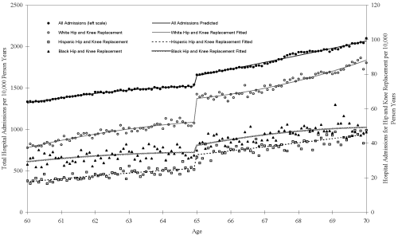

## Some Drawbacks of Randomized Control Trials

- As early as 1920s, Fisher (1928) argued that the only satisfactory way of looking at the treatment effects was to assign treatment and control groups 
``wholly at random"
- RCT has been widely utilized in fields such as medicine, agriculture, pharma industry 
- Costly
- Unethical
- External Validity problems

## Natural Experiments to trace the causal effects

- $y=\alpha +\beta x + \gamma temp + \epsilon$

- Here, variables in $\epsilon$ affects both $x$ and $y$, which creates difficulty in tracing the causal effect 

- Remember the example of the bottles of sun screen and glasses of lemonade


## Natural Experiments to trace the causal effects
- Now, say you are interested in finding whether increase in glasses of lemonade does increase the purchase of sun screen.
(A dull question, but still lets see if we can identify the causal effects.)

- To do so, we need external force (also known as shocks in economics), that affects the quantity of lemonade purchased. 
    - This shock should only affect quantity of lemonade and should not directly affect the demand for sun screen.
    - can you think of something that resemble such shocks?
    
- Some thing in the natural, that affects the purchase of lemonade but does not directly affect the purchase of sun screen. So, any effect 
on sun screen will be driven through the changes in purchase of lemonade. 

    
## Natural Experiments .. 

- These types of shocks are also known as ``instruments" in economics. 

- Shocks in lemon farming due to increasing Botrytis fungus around the area.

- increases the price of lemons, which drives the price of lemonade up 

- Utilize the variation in price to identify, whether increase in purchase of lemonades also makes people buy more of sun scree 

- $y_{t}=\alpha +\beta price_{t}(lemons) + \gamma temp_{t} + \epsilon_{t}$, where $t$ is the time subscript. 
    - $\beta_{hat}>0$, that price of lemons is causally and positively related to demand of suncreen lotion.
    - price of lemons increases, reduces the quantity demand of lemons
    
## Natural Experiments .. 
```{r}
set.seed(1)
#simulate quantity demanded of lemonades
lemonade = rnorm(100, 50, 10) 
error = rnorm(100, 0, 1)
sunscreen = 1/2*lemonade + 8*error
temp = 1.2*lemonade + 0.4*sunscreen
data <- data.frame(cbind(lemonade, sunscreen, temp))
reg1 <- lm(sunscreen ~ lemonade, data)
reg2 <- lm(lemonade ~ sunscreen, data)
reg_control <- lm(lemonade ~ sunscreen + temp, data) 
```

## Natural Experiments .. 
```{r}
summary(reg1)
```


## Natural Experiments .. 
```{r fig2, fig.height=2.5, fig.width=4, fig.align="center"}
library(ggplot2)
ggplot(data, aes(x=sunscreen, y = lemonade)) + geom_point() + theme_minimal() + geom_smooth(method = lm, color = "red", lwd = 0.75) + annotate("text", x = 10, y = 70, color = "blue", 
           label = paste("Slope =", 0.51))
```

## Natural Experiments .. 
```{r fig3, fig.height=2.5, fig.width=4, fig.align="center"}
library(ggplot2)
ggplot(data, aes(x=temp, y = lemonade)) + geom_point() + theme_minimal() + geom_smooth(method = lm, color = "red", lwd = 0.75) + annotate("text", x = 10, y = 70, color = "blue", 
           label = paste())
```

## Natural Experiments .. 
```{r fig4, fig.height=2.5, fig.width=4, fig.align="center"}
library(ggplot2)
ggplot(data, aes(x=temp, y = sunscreen)) + geom_point() + theme_minimal() + geom_smooth(method = lm, color = "red", lwd = 0.75) + annotate("text", x = 10, y = 70, color = "blue", 
           label = paste())
```

## Natural Experiments .. 
```{r}
summary(reg2)
```

## Natural Experiments .. 
```{r}
summary(reg_control)
```
    
## Natural Experiments (simplified)
  ```{r echo=FALSE, foo, out.width="50%", fig.cap="Figure 1."}
  knitr::include_graphics("natural_experiment.pdf")
  ```
Note: The third factor variables can be driving consumption of both sunscreen and lemonade. What we want is a 'shock' to 
lemonade production, that affects the purchase of lemonade and traces the dotted link. Note that the 'shock' does not affect
the suncreen purchase directly. This 'shock' is also known as an instrument in research.

## Natural Experiments using the Regression Discontinuity Approach

- Now lets get back to estimating whether demand for health care and services are downward sloping. To understand this phenomenon, 
Card, Dobkin and Maestas (2008) used eligibility criteria as a 'shock' (if you will), to determine whether an average individual uses 
more health care when eligible for Medicare. 

- Note that a US citizen, after turning 65, is eligible for Medicare. Age determines the eligibility criteria. However, you cannot really 
control age (there are some other limitations however).

- Medicare, in a sense, resembles a form of universal health insurance in US. 

- The authors compare people around the eligibility criteria to identify the effects of change in health insurance coverage through 
Medicare coverage on utilization of health care and services.
    - This kind of design is know as a regression discontinuity design.
    
## Card, Dobkin and Maestas (2008) RD Approach
```{r echo=FALSE, card2008, out.width="80%", fig.cap="Figure 2."}

```


## The Oregon Health Insurance Experiment (Finkelstein et al. 2012)

- In 2008, Oregon did a lottery, to randomly assign health insurance to a group of low-income adults
    - 90,000 people who signed up received it.

- The lottery provides a unique randomized experiment through policy.
    - confounding or third factors are avoided due to random assignment
    
- Use administrative data from hospital discharge, credit report and mortality records
    - Higher utilization of health care (2.1 percentage points increase in probability of hospital visits, 8.8 pp increase in probability of taking any prescription drug, 21 pp increase in probability of any outpatient visit)
    - lower out of pocket medical expenses
    - better self reported health
    
## A Randomized Experiment Shrestha and Shrestha (2020)
```{r echo=FALSE, shrestha&shrestha1, out.width="40%", fig.cap="Figure 2a. Demand for Sanitary Pads"}
knitr::include_graphics("menstruation1.pdf")
```

## A Randomized Experiment Shrestha and Shrestha (2020)
```{r echo=FALSE, shrestha&shrestha2, out.width="40%", fig.cap="Figure 2b. Demand for Sanitary Pads by Treatment Criteria"}
knitr::include_graphics("menstruation2.pdf")
```

## Concluding Remarks 

- So the empirical evidence do point out that the demand for health care and services are downward sloping 

- However, the effects are homogeneous. For instance, although inelastic, outpatient visits are relatively more elastic than inpatient visits.

- Nevertheless, it should be realized that there are other forces at play that economists generally tend to ignore. 
    - For instance, Alsan and Wanamaker (2017) finds that the disclosure of Tuskegee experiment in 1972 is correlated with medical mistrust among older black men. 
        - reduced life expectancy
    - In presence of medical mistrust, do people still respond to lower prices? 
    
## Feedback to Homework 2
1. $q=-\frac{1}{4}\times p + 200$ . 
- point elasticity = $\frac{\Delta Q}{\Delta P} \times \frac{P}{Q}$ .. eq (1)
- $\frac{\Delta Q}{\Delta P}=-\frac{1}{4}$
- Find $Q$ when $p=\$5$
- replace eq. and solve
- You need to note the - signs for the elasticity estimates
- Also, make sure that you realize the tope part of the demand curve is relatively more elastic, compared to the bottom part. This should be evidence from e.

## Question 2

$doc\;visits=g(Insurance,\;Education,\;Income,\;Demographics,\;\epsilon)$
a. It is difficult to say, because there are factors in $\epsilon$ that confounds the relationship. For example, risk preference, which is in $\epsilon$, can be 
driving both purchase of insurance and doctor visits. 
b. Nope. See a.
c. This will not say anything about the demand curve as those who are insured and uninsured cannot be compared. 

- At this point it is important to understand that correlation is not causal. Even in this powerpoint, there are ways that can help build causal interpretations, including 
randomized control trials and natural experiments. 
- For example, Question 3 on PS2 deals with a setting of a randomized control trial. Here, the assignment mechanism of who gets the insurance verus who does not 
is random. Please revise question 3 on yourself. 

