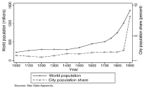
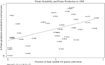

```{r setup, include=FALSE}
knitr::opts_chunk$set(echo = FALSE)
```

## Introduction [Nunn and Qian (2010)](https://pubs.aeaweb.org/doi/pdfplus/10.1257/jep.24.2.163)

- Columbian exchange: exchange of disease, food, and ideas following Columbus's voyage to Americas in 1492.
- created exchange between the new world (Americas) and the old world (Europe, Africa, Asia)
    - food (potatoes, sweet potatoes, maize) (sugarcane, tobacco)
    - disease (smallpox, measles, influenza, chickenpox) and native population
    - spearheaded industrial revolution
- Goal: Broaden areas of economics by incorporating historical elements to explain adaptation and reallocation of resources. 
    - Broad perspective
    - provoke questions rather than answering any narrowly set question.
    
## Disease

- transported to the new world from the old world 
    - smallpox, measles, chicken pox, bubonic plague, malaria
- native population had no immunity to these new type of diseases
    - Dobyns (1983) writes, "Before Europeans initiated the Columbian Exchange of germs and viruses, the people of Americas suffered no smallpox, no measles, no chickenpox, 
    no influenza .. "
- decimated the native population; although exact magnitude of the disaster is still unknown 
    - about 80-95 percent of Native American population was decimated within the first 100-150 years following 1492 (Newson, 2011)
    - Central Mexico's population fell from just under 15 million in 1519 to roughly 1.5 million a century later
    - lost at least 80 percent of their population (Cook, 1998)
- controversy regarding syphilis

## Food

- Columbian exchange expanded global supply of agriculture 

- Potatoes, sweet potatoes, maize, and cassava were found in the New World. Soon adapted all over the globe.
- Contribution to population growth,
    - between 1000 and 1900, world population grew from 300 million to 1.6 billion
    
```{r echo=FALSE, worldpop, out.width="50%", fig.cap="Figure 1. Nunn and Qian (2011)"}

```
- Potatoes contributed to population growth (native to South America)
    - high calories 
    - improved agricultural productivity in the Old World
- Nunn and Qian (2011) uses time and suitable climate to cultivate potatoes (time-invariant geoclimatic conditions)
    - Potato accounts for approximately 25-26 percent of increase in total population (between 1700 to 1900)
    
## Transfer of New World Food to the Old World
- See Table 2 (pg. 170)
- See Table 3 (pg. 174)

## Potatoes 
    
```{r echo=FALSE, figure3, out.width="50%", fig.cap="Figure 2. Nunn and Qian (2011)"}

```

- contributed to the industrial revolution

## Old to the New World
- sugar cane, coffee
    - fuled demand for labor 
    - transatlantic slave trade (between the $14^{th}$ and $19^{th}$ century)
    - forced movement of over 12 million slaves from Africa to the Americas
    
## Next Class
- [Alsan and Wanamaker 2017](https://www.nber.org/system/files/working_papers/w22323/w22323.pdf)
    

