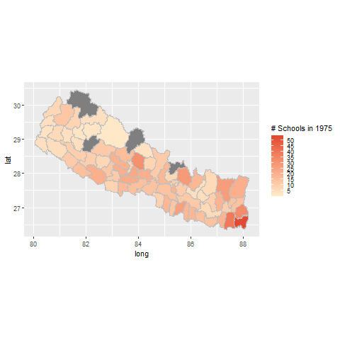
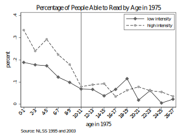
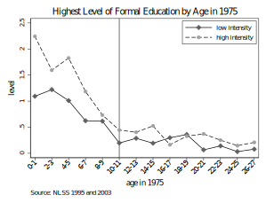

```{r setup, include=FALSE}
knitr::opts_chunk$set(echo = FALSE)
```

## Introduction 

- Educating women is viewed as one of the most effective policy measures in improving human development outcomes
    - Mothers pass on benefits
       - cognitive development, improved academic success, income, better health outcomes
       
- Kofi Annan (2003) "No other policy is as likely to raise economic productivity, lower infant and marternal mortality, 
improve nutrition and promote health."


- Study evaluates the impact of basic maternal literacy skills such as ability to read, write, and the highest level of formal education 
on infant health 

    
##  Problem 

- correlation vs. causality 

\begin{equation}
Y = \alpha + \beta Educ + \gamma X + \epsilon
\end{equation}

- factors influencing both mother's education and child health may not be properly accounted for; risk preference, discount factor 
- child health can determine mother's education (reverse causality)


## Natural Experiment 

- Formal education only began in 1951, after the fall of Rana regime after 104 years of rule 
- Literacy rate in 1951 was around 5 percent. 

- National Education System Plan (NESP) was established in 1971
    - provision of free primary text, 
    - implementation of a standarized curriculum and textbooks
    - supply of trained teachers
    - construction of new schools 

- Use this reform as a quasi-natural experiment to evalaute the effects of mothers education on children's health outcomes

- Two levels of variation
    - intensity of NESP by district 
    - exposed vs unexposed 
    
## Intensity and Exposed vs. Unexposed Group 

```{r echo=FALSE, imagea, out.width="75%", fig.cap="Figure 1. NESP Intensity -- School construction"}

```

- Age in 1975 
    - 0-9 exposed
    - 10-27 unexposed
    
## Data
- Nepal Living Standard Survey 1995 and 2003
    - focuse on 0-27 year olds in 1975, would have been 20-47 year olds in 1995 and 28-55 year olds in 2003
    - track mother's infant health outcomes given by infant and child mortality 
    
    
## Basic Identification
```{r echo=FALSE, imageb, out.width="75%", fig.cap="Figure 2. NESP and Education Outcomes"}

```

```{r echo=FALSE, imagec, out.width="75%", fig.cap="Figure 3. NESP and Education Outcomes"}

```

## Identification Strategy 
- See manuscript 

